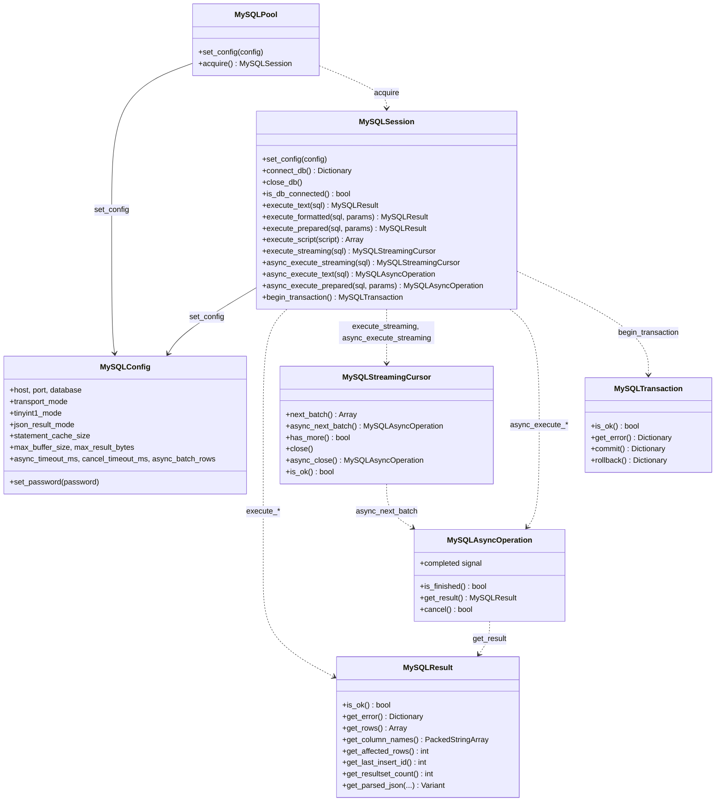
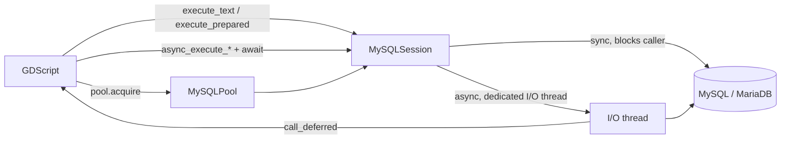

# Features

## Module structure

Seven classes are exposed to GDScript. `MySQLSession` is the entry point for a single
connection; `MySQLPool` hands out sessions from a shared pool for multithreaded use.
Every fallible call returns/fills an object with `is_ok()`/`get_error()` instead of
throwing (see "Error model" below).



Internally (not exposed to GDScript), `MySQLSession` wraps a single `any_connection`
(Boost.MySQL) plus a per-connection prepared-statement LRU cache; `async_*` calls run on a
dedicated I/O thread per session, delivering the result back to the main thread via
`call_deferred`, never directly from the background thread.



## Intended use

**This module is for a headless Godot server or an internal tool, never for a game
shipped to players.** It opens a real network connection to a MySQL/MariaDB server using
credentials that live in `MySQLConfig`; anyone who can reach an exported game can also
reach whatever that connection can reach. If the module ends up in a client build at all,
the database user it connects with must have the minimum privileges the game
needs (for example, only `SELECT`/`INSERT` on specific tables, never a database
administrator account), and `transport_mode` should stay at `TCP_TLS_REQUIRED` (the
default) unless there is a specific, trusted reason not to.

## Supported databases

MySQL and MariaDB. Features that exist in only one of them (specific authentication
plugins, native JSON vs. `LONGTEXT` with a `CHECK` constraint on MariaDB, different
collation lists) are documented as exceptions where they matter, never assumed to be
universal.

## Connection

* Transports (`transport_mode`): `TCP_TLS_DISABLED`, `TCP_TLS_PREFERRED`,
  `TCP_TLS_REQUIRED` (default), `UNIX_SOCKET`. There is no UNIX+TLS: a UNIX socket is
  local by nature and never uses TLS.
* TLS with certificate validation enabled by default when TLS is in use; the host name
  used for verification is derived from the real connection endpoint.
* Authentication methods: `mysql_native_password` and `caching_sha2_password`.
* Every setting that lowers security (TLS disabled, multi-queries enabled, etc.) emits a
  warning at the moment it is set.
* A session or pool keeps its own copy of the `MySQLConfig` it receives in
  `set_config()`. Changing the config afterwards has no effect on it, so the TLS settings a
  connection verifies with are always the ones it connects with.

## Methods

* Text queries: MySQL calls this the "text protocol", because all information is passed
  as text (as opposed to prepared statements). Raw text and formatted text
  (`with_params`/`format_sql`, no home-made escaping) are both supported.
* Prepared statements: MySQL calls this the "binary protocol", because the result of
  executing a prepared statement is sent in binary format rather than text. Statements
  are kept in a per-connection LRU cache, sized by `statement_cache_size` (default 512).
  When the cache is full, the least recently used statement is closed on the server
  before being dropped. `statement_cache_size` is per connection; a server's
  `max_prepared_stmt_count` system variable is a single limit shared by every connection
  on that server, so raising it a lot on a pool with many connections is worth checking
  against that limit. A pooled connection is reset before every new lease, which closes
  its prepared statements, so each lease starts with an empty cache.
* Multi-function operations. They can contain stored procedures.
* Stored procedures.
* SQL scripts and multi-queries are **disabled by default** and independent of each
  other: `allow_sql_script_execution` (manual script API) and `allow_multi_queries`
  (capability negotiated with the server).
* **Streaming:** incremental reading of large results (`MySQLStreamingCursor`), without
  loading everything in memory at once — synchronous (`execute_streaming()`) or
  asynchronous (`async_execute_streaming()`, see below).
* **Asynchronous methods** that run without blocking the calling thread. See
  "Asynchronous methods" below.
* Transactions (`MySQLTransaction`, obtained via `MySQLSession.begin_transaction()`) and
  a connection pool (`MySQLPool`), with multithreading support — each thread uses its
  own `MySQLSession`, never a connection shared between threads at the same time.

### Asynchronous methods

Each `async_*` call runs on a dedicated I/O thread and returns immediately, without
blocking the calling thread (earlier versions of the module blocked the caller instead).
`async_execute_text()` and `async_execute_prepared()` each return a
`MySQLAsyncOperation`. Wait for its `MySQLResult` through a small helper that checks
`is_finished()` before awaiting `completed`:

```gdscript
func await_result(op: MySQLAsyncOperation) -> MySQLResult:
    if op.is_finished():
        return op.get_result()
    return await op.completed

var op := session.async_execute_text("SELECT SLEEP(1)")
# ... other work, including other awaits ...
var result := await await_result(op)
```

`completed` fires exactly once and is never sent again. If anything else is awaited
between starting the operation and awaiting it (a timer, another operation), the operation
may already have finished, and a bare `await op.completed` then waits forever for a signal
that has already fired. `await session.async_execute_text(...).completed` in a single
statement is safe, since nothing can run in between, but the helper is safe everywhere.

**Always `await` the operation; never poll it in a busy-wait loop**
(`while not op.is_finished(): pass`). A busy-wait loop blocks the `SceneTree` from
processing frames, and processing frames is what delivers the result back to the caller.
The operation still finishes — the loop never notices.

**Keep the `MySQLSession` (or the `MySQLPool` it came from) alive until the operation
finishes.** If every reference to the session goes out of scope first, Godot frees the
session and stops its I/O thread mid-operation: `completed` then never fires. A pooled
session freed this way does not hand its connection back to the pool (it would still be
busy); the pool closes that connection and opens a new one when needed.

A session processes one asynchronous operation at a time. Starting a second `async_*`
call while the first one is still running does not queue the second call — it fails
immediately with an explicit error (category `mysql.client`), while the first operation
keeps running unaffected. The same applies to every other call on that session while the
operation runs — `execute_*`, `execute_streaming`, `begin_transaction`, `connect_db`,
`close_db`: each fails with that same error without touching the connection (in
particular, `close_db()` does not close it from under the running operation). Run
parallel operations from separate sessions, for example one session per operation leased
from a `MySQLPool`.

#### Asynchronous streaming

`async_execute_streaming()` returns a `MySQLStreamingCursor` right away and opens it on the
I/O thread. Each `async_next_batch()` reads one batch there and returns a
`MySQLAsyncOperation` whose `MySQLResult` holds the rows of that batch, so the loop never
blocks the calling thread:

```gdscript
var cursor = session.async_execute_streaming("SELECT * FROM big_table")
while cursor.has_more():
    var batch = await cursor.async_next_batch().completed
    if not batch.is_ok():
        push_error(batch.get_error())
        break
    for row in batch.get_rows():
        process(row)
```

* The first `async_next_batch()` waits for the cursor to open. An error while opening
  reaches its result and `cursor.is_ok()`. `has_more()` stays `true` until that first
  batch has been taken, even if it already arrived.
* Every batch gathers at least `async_batch_rows` rows (default 500), fewer only at the end
  of the resultset. One read from the server returns only what fits in the connection's
  read buffer, often a handful of rows, and each batch costs at least a frame to `await`.
* One batch at a time: calling `async_next_batch()` again before the previous batch
  arrives fails with an explicit error. Between batches the cursor holds the connection,
  as a synchronous cursor does.
* `async_close()` drains what is left on the I/O thread and completes once the connection
  is free. A cursor released without closing it drains in the background; the session
  stays busy until that ends. `close()` still works, but it blocks while it drains.
* `async_timeout_ms` applies to every read, and `cancel()` works on the operation of a
  batch (below). Like `execute_streaming()`, it reads one resultset only.

#### Cancelling an operation

`MySQLAsyncOperation.cancel()` stops an operation that is still running. It returns
`false` if there is nothing to cancel (the operation already finished, or was rejected
because the session was busy), `true` otherwise; calling it again does nothing more. The
operation still finishes through `completed`, as usual:

```gdscript
var op := session.async_execute_text("SELECT ...")
# ...
op.cancel()
var result := await await_result(op)
```

It works in two steps:

1. **On the server.** The module opens a short-lived side connection with the same
   `MySQLConfig` and runs `KILL QUERY` on the operation's connection. The server stops
   the query, and the operation fails with the server's non-fatal "Query execution was
   interrupted" error; the session stays connected and usable. Some functions do not
   fail when interrupted and return early instead (`SLEEP()` returns `1`), so the
   operation can also finish with a normal result. It finishes with its full result as
   well if the query was already done when the `KILL` arrived.
2. **Locally, as a fallback.** If the side connection cannot connect or run the `KILL`
   within `cancel_timeout_ms` (default 5000, per step, `0` = no timeout), the module
   cancels the operation on its own side. It fails with a fatal error, and the connection
   is dropped (see "Error model" below): reconnect with `connect_db()`. The query may keep
   running on the server until it finishes.

`KILL QUERY` on a connection of the same user needs no extra privilege. Until the `KILL`
is done, the session stays busy even if the operation already finished, so the `KILL`
never reaches a query started after it.

### Automatic rollback

Every `MySQLTransaction` must be closed explicitly with `commit()` or `rollback()`.
**If it is destroyed (all references released) without either having been called, the
module issues a `ROLLBACK` automatically** and logs a warning in Godot saying so.

This is a safety net against a forgotten transaction left open on the connection — for
example, if the script leaves scope too early, raises an error before reaching
`commit()`, or simply forgets. **It is not a recommended flow**: always close the
transaction yourself, on the success path and on the error path (`commit()` on one,
`rollback()` on the other). Relying on the automatic rollback keeps the transaction open
for longer than needed, until Godot's reference counting destroys the object.

## Limits

* `max_buffer_size` (default 64 MB): limits the size of a single protocol packet — one
  request sent, or one row received. Boost.MySQL enforces this itself; the config option
  only exposes it instead of leaving it hardcoded. It does **not** limit the total size of
  a result: a resultset with many rows can still add up to far more than
  `max_buffer_size` in total.
* `max_result_bytes` (default `0`, no limit): limits the total estimated size (every
  resultset, every row added up) of a single `execute_*`/`async_execute_*` call. Enforced
  by reading the result incrementally and aborting as soon as the running total goes over
  the limit — the call fails explicitly with a client-side error instead of silently
  truncating the result, and this bounds peak memory instead of only checking it after
  the fact. The size counted per cell is an estimate (the exact byte length
  for strings/blobs, a small fixed cost for every other type), not the protocol wire size.
  Does not apply to `MySQLStreamingCursor`, which already reads incrementally and hands
  control back to the caller between batches.
* `async_timeout_ms` (default 30000, `0` = no timeout): applied per network round trip of
  an asynchronous operation (each step of reading the result), not once for the whole
  call — a result read in several batches or with several resultsets gets a fresh budget
  on every step instead of one shared deadline for all of them. An operation that times
  out fails with a fatal error and drops the connection (see the error model below).

## Error model

No exceptions in any layer (`no_exception`, like the Godot default). Every fallible
operation exposes `is_ok()` and `get_error() -> Dictionary`, with the keys `category`,
`message`, `server_message` and `is_fatal`. There is no global or per-instance error
state — each call carries its own result.

A fatal error (`is_fatal == true`: a lost connection, a protocol error, an expired
`async_timeout_ms`) leaves the connection in an unspecified state, so the module drops it
instead of reusing it: `is_db_connected()` returns `false` and the next call fails with a
"not connected" error until `connect_db()` reconnects. Without this, a timed-out query's
reply would still be on its way, and the next query would read it as its own result. A
pooled session dropped this way hands the pool an unconnected connection, which the next
lease reconnects.

## Equivalent data types

### Results (MySQL/MariaDB to Godot)

| Data type | Godot data type | C++ data type (Boost.MySQL) | MySQL data type | Notes |
| :---: | :---: | :---: | :---: | :--- |
| NULL | `null` | `std::nullptr_t` (`field_view()`) | NULL | |
| BOOL | `bool` | `std::int64_t` / `std::uint64_t` | `TINYINT(1)` | Only when `tinyint1_mode` is enabled **and** the column display width is 1; any other `TINYINT` width becomes `int` |
| INT | `int` | `std::int64_t` | signed `TINYINT`, `SMALLINT`, `MEDIUMINT`, `INT`, `BIGINT` | |
| UINT | `int` | `std::uint64_t` | `UNSIGNED` `TINYINT`, `SMALLINT`, `MEDIUMINT`, `INT`, `BIGINT` (up to `INT64_MAX`), `YEAR`, `BIT` | |
| UINT (large) | `String` | `std::uint64_t` | `BIGINT UNSIGNED` above `INT64_MAX` | ⚠️ See the warning below |
| FLOAT | `float` | `float` | `FLOAT` | |
| DOUBLE | `float` | `double` | `DOUBLE` | |
| BINARY | `PackedByteArray` | `boost::mysql::blob_view` | `BINARY`, `VARBINARY`, `BLOB` (all sizes), `GEOMETRY` | |
| CHAR | `String` | `boost::mysql::string_view` | `CHAR`, `VARCHAR`, `TEXT` (all sizes), `ENUM`, `SET`, `DECIMAL`, `NUMERIC` | Always `utf8mb4`. `SET` arrives as the comma-separated text the server sends |
| JSON | depends on `json_result_mode` | `boost::mysql::string_view` | `JSON` | See `json_result_mode` below |
| DATE | `Dictionary` | `boost::mysql::date` (`std::chrono::time_point<std::chrono::system_clock, days>`) | `DATE` | Keys: `year`, `month`, `day` |
| TIME | `Dictionary` | `boost::mysql::time` (`std::chrono::microseconds`) | `TIME` | Keys: `negative`, `hours`, `minutes`, `seconds`, `microsecond`. Hours can exceed 24 and the sign is kept separately |
| DATETIME | `Dictionary` | `boost::mysql::datetime` (`std::chrono::time_point<std::chrono::system_clock, std::chrono::duration<std::int64_t, std::micro>>`) | `DATETIME`, `TIMESTAMP` | Keys: `year`, `month`, `day`, `hour`, `minute`, `second`, `microsecond` |

> ⚠️ **`BIGINT UNSIGNED` above `INT64_MAX` (9223372036854775807) arrives as a `String`,
> not an `int`.** Godot's `Variant::INT` is a signed 64-bit integer and cannot hold the
> exact value in these cases. This means **the same column can return `int` for most
> rows and `String` only for the rows with a large value** — always check the type
> (`typeof(value) == TYPE_STRING`) before doing arithmetic with a `BIGINT UNSIGNED`
> field.

### Parameters (Godot to MySQL/MariaDB)

Used by `execute_formatted()`, `execute_prepared()` and `async_execute_prepared()`.

| Godot data type | C++ data type (Boost.MySQL) | Sent as | Notes |
| :---: | :---: | :---: | :--- |
| `null` | `field_view()` | `NULL` | |
| `bool` | `std::int64_t` | `BIGINT` (0 or 1) | Sent as an integer, not as a distinct boolean type |
| `int` | `std::int64_t` | `BIGINT` | |
| `float` | `double` | `DOUBLE` | |
| `String`, `StringName` | `boost::mysql::string_view` | `VARCHAR`/`TEXT` | Sent as `utf8mb4`, with its length, never as a C string |
| `PackedByteArray` | `boost::mysql::blob_view` | `BLOB` | |
| `Dictionary` | `boost::mysql::date`/`datetime`/`time` | `DATE`/`DATETIME`/`TIME` | Which one depends on the `Dictionary`'s keys — the same shape `get_rows()` returns for that type (see "Results" above): `{year, month, day}` for `DATE`, `{year, month, day, hour, minute, second, microsecond}` for `DATETIME`, `{negative, hours, minutes, seconds, microsecond}` for `TIME`. A `Dictionary` matching none of the three shapes, or with an out-of-range component, is an explicit error naming the problem, never a value silently clamped or wrapped around |
| any other type | — | — | Explicit error, never a silent `NULL` |

### `json_result_mode`

* `RAW_STRING`: returns the text exactly as it came from the server.
* `PARSED_VARIANT`: converts immediately to `Dictionary`/`Array`/`Variant`, using Godot's
  `JSON` class.
* `LAZY_PARSED_VARIANT` (**default**): keeps the string and only converts when asked; the
  converted result may be cached.

> ⚠️ **On MariaDB, `PARSED_VARIANT` behaves like `RAW_STRING`.** Automatic detection of
> which column is JSON depends on the server reporting a distinct `JSON` type in the
> metadata — MySQL does that, but **MariaDB does not**: there, `JSON` is an alias of
> `LONGTEXT` with a `CHECK` constraint behind it, and the column arrives as plain
> text. To convert JSON explicitly regardless of the database, use
> `get_parsed_json(resultset, row, column)` — it does not depend on the column type and
> parses whatever text you point at.

## Performance

[`../benchmark/`](../benchmark/) measures the module from GDScript, one Godot scene per
situation, and [`../benchmark/RESULTS.md`](../benchmark/RESULTS.md) has the results on
the development machine. In short, with the server on the same machine:

* `execute_text`, `execute_formatted` and `execute_prepared` cost about the same per call.
  A prepared statement that has to be prepared again on every call (its cache too small)
  costs almost three times as much.
* An awaited asynchronous call waits for the next frame, so a series of them runs at one
  per frame; in exchange, a heavy query no longer stalls the frame it runs in.
* `async_batch_rows` trades frames for memory: small batches make a large result take many
  frames, large ones hold more rows at once.
* Leasing a pooled session resets its connection, one extra round trip: lease a session
  once per task, not once per query.
* `DATE`/`DATETIME`/`TIME` and JSON parsed into a `Variant` are the most expensive types to
  convert; `LAZY_PARSED_VARIANT` (the default) defers the JSON cost until
  `get_parsed_json()`.

## Platforms

* **Linux x86_64**: primary development and testing platform.
* **Windows x86_64**: cross-compiled from Linux with MinGW-w64 and verified running under
  Wine against a real server, including the asynchronous methods (native IOCP on
  Windows).
* **Android (arm64-v8a, armeabi-v7a, x86_64, x86_32)**: cross-compiled with the NDK; the
  full integration test suite (97 checks) verified on two real physical devices
  (arm64-v8a), not an emulator.
* **macOS**: not done yet — Need Help.
* **iOS**: not done yet — Need Help.

See [instructions.md](instructions.md) for the exact build steps per platform.

## Distribution

GDExtension support is a future direction.

## Godot

Minimum supported version: **4.6**.
