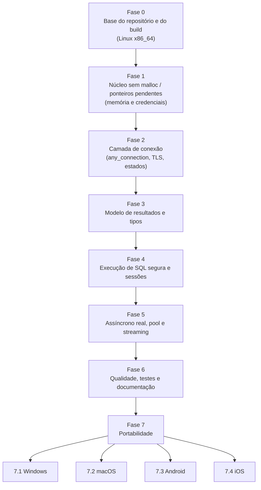
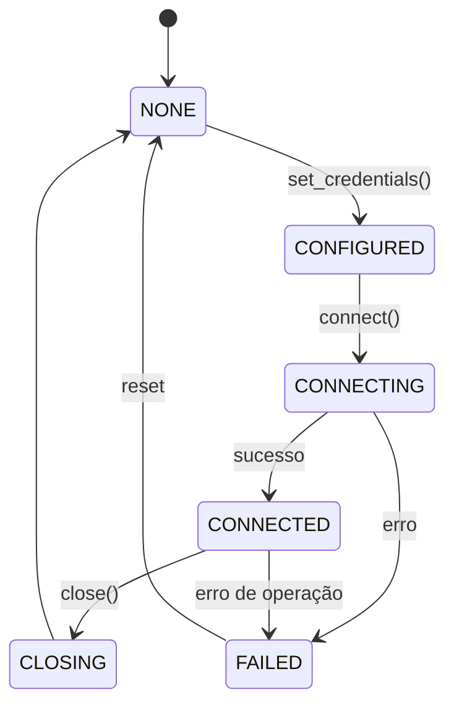
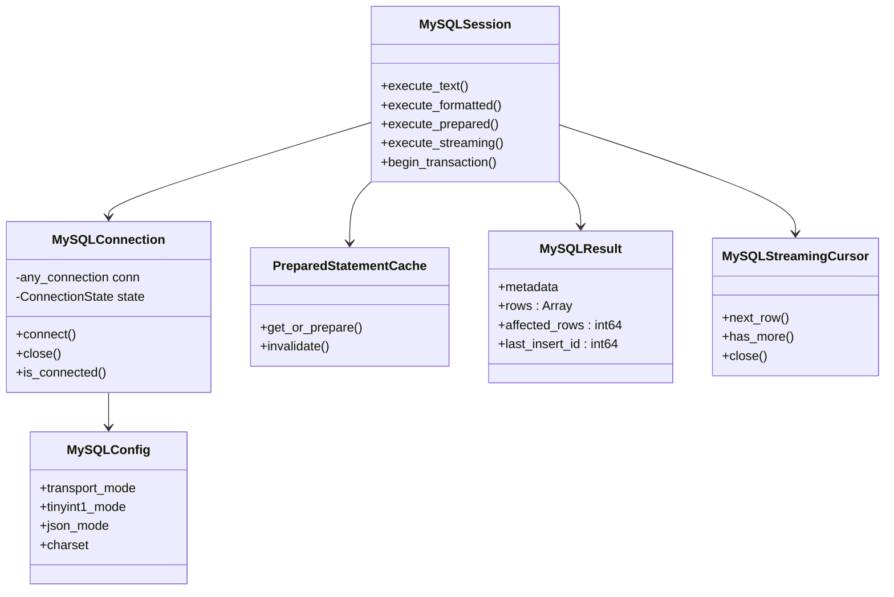

# Roadmap — Reescrita do módulo MySQL para Godot

Data: 21/09/2026 | Base: auditoria consolidada (`auditoria.docx`, 64 problemas) e sugestões
priorizadas (`sugestoes.docx`), ambos de 19/09/2026 (absorvidos neste documento; os
`.docx` não fazem mais parte do repositório).

Detalhes de API e comportamento que vão sendo fechados em conversa ficam em
`design-notes.md`, não neste arquivo — este aqui é só o plano de fases.

**Status (21/09/2026): design fechado.** O código antigo (`scr/mysql.*`,
`scr/sql_result.*`, `scr/helpers.*`, `scr/constants.h`, `doc_classes/`, `icons/`,
`fix.sh`) foi removido e substituído por um esqueleto vazio com os arquivos da
arquitetura alvo da seção 4, um por classe. A implementação real começa pela Fase 0.

## 0. Decisão de estratégia

O módulo será **reescrito**, não corrigido no lugar. O rebuild feito num chat do ChatGPT
não entra como referência — nem código nem as decisões de arquitetura negociadas lá (5
classes, pool, `transport_mode` etc.) são assumidas aqui. Este roadmap parte só da
auditoria consolidada e do código atual em `mysql/`.

Decisões confirmadas por você para este roadmap:

- **Godot mínimo suportado: 4.6** (sem mudanças na API de rede desde então). A árvore
  local (`godot/`, hoje 4.8.0-dev) continua sendo usada para desenvolver; a compatibilidade
  com 4.6 é revalidada a cada marco, não a cada commit.
- **Plataformas-alvo: Linux, Windows, macOS, Android, iOS.** Desenvolvimento e todas as
  fases 0–6 acontecem só em **Linux x86_64 (Ubuntu)**. As outras quatro plataformas são
  portadas depois, na Fase 7, quando o módulo já estiver pronto.
- **Todos os problemas da auditoria são corrigidos** (não há itens "adiados para depois
  da v1" como no rebuild descartado) — o que muda é a ordem, não o escopo.
- **Todas as capacidades atuais são mantidas** (ver seção 2) e **streaming é adicionado**
  como capacidade nova.

## 1. Visão geral das fases

Cada fase só começa quando a anterior compila, linka e passa pelos testes locais da
Fase 6 (que evolui em paralelo, não só no fim — ver seção 3.6).

## 2. Capacidades: o que fica, o que corrige, o que é novo

| Capacidade | Situação |
|---|---|
| Conexão TCP e TCP+TLS | Mantida, TLS com validação de certificado real por padrão (hoje não valida) |
| Conexão UNIX socket | Mantida |
| **UNIX + TLS** | **Não existe hoje de fato** — `capabilities.md` afirma incorretamente que existe; o Boost.MySQL não suporta TLS sobre socket UNIX. Corrigido na documentação, não é uma capacidade removida, é uma que nunca funcionou |
| Autenticação `mysql_native_password` e `caching_sha2_password` | Mantida |
| Métodos assíncronos | Mantidos, mas deixam de bloquear a thread chamadora (hoje `async_*` bloqueia até terminar) |
| Multi-function operations | Mantida, com leitura incremental corrigida (hoje pode entrar em loop ou dessincronizar a conexão) |
| Stored procedures | Mantida |
| Text queries | Mantida, com forma seguro de montar query (`with_params`/`format_sql`) além do SQL bruto |
| Prepared statements | Mantida, com cache (hoje prepara/executa/fecha a cada chamada — 3 round-trips) |
| Tipos de dados (tabela de equivalência) | Mantida, com correções de precisão (uint64, TINYINT, TIME/DATE com microssegundos) |
| **Streaming** | **Nova.** Leitura incremental de resultados grandes sem carregar tudo em memória |

## 3. Fases

### Fase 0 — Base do repositório e do build

Escopo: Linux x86_64 apenas. Esforço: P–M.

- Remover `fix.sh` do repositório (automatiza commit/push e cita `3party/`, que não existe
  mais).
- Adicionar `LICENSE` (MIT) e cabeçalho `SPDX-License-Identifier: MIT` nos arquivos.
- Corrigir `register_types.h` (sem include guard) e o guard genérico de `constants.h`.
- Manter `config.cfg` lido pelo `SCsub` (é o mecanismo que você pediu). Endurecer o
  `SCsub`: checar existência e versão mínima dos headers do Boost/OpenSSL, remover
  `lib64` fixo, tornar os nomes de lib configuráveis (MSVC usa outros nomes que os do
  GCC — necessário para a Fase 7), `can_build()` real por plataforma.
- Fixar Boost e OpenSSL em **tags estáveis** (hoje são branches de desenvolvimento:
  `boost-1.92.0-71-g…`, `openssl 4.0-POST-…`) e recompilar `thirdparty/`.
  > ⚠️ Decisão em aberto: qual OpenSSL usar — 3.5 LTS ou 3.6.x? Preciso da sua resposta
  > antes de fechar esta fase.

**Saída:** build limpo, sem dependências de branch de desenvolvimento, sem scripts que
commitam/enviam sozinhos.

### Fase 1 — Núcleo sem malloc / ponteiros pendentes

Escopo: Linux x86_64. Esforço: P–M. Resolve S1, S2 (parcial), S3, S6, S10, S12, S13.

Nenhuma linha desta fase reaparece nas fases seguintes porque é a base de tudo: se aqui
não existir `malloc`/`char*` nem ponteiro para temporário, as fases de conexão e SQL que
vêm depois não podem reintroduzi-los.

- Credenciais em tipo próprio (não `malloc`/`char*`); apagadas (`OPENSSL_cleanse` ou
  equivalente) ao trocar e ao destruir; `get_credentials()` deixa de devolver a senha.
- Toda leitura de `String::utf8()` é copiada com o comprimento (`String::utf8(data,
  size)`) antes de ser usada — nunca guardar `.utf8().get_data()` numa variável. Regra
  registrada no `AGENTS.md` do módulo.
- `Variant` de tipo não suportado nos parâmetros vira erro explícito, nunca `NULL`
  silencioso.
- Mensagens de erro verbosas (arquivo/linha/mensagem do servidor) só em build de debug.

**Saída:** utilitários de string e credencial testados isoladamente; zero alocação manual
no módulo.

### Fase 2 — Camada de conexão

Escopo: Linux x86_64. Esforço: G. Resolve A1, A3, S2 (residual), S5, C5, C6.

- Substituir as 4 classes de conexão legadas (`tcp_connection`, `tcp_ssl_connection`,
  `unix_connection`, `unix_ssl_connection`) por `any_connection` + `connect_params`.
  **Primeiro passo obrigatório desta fase:** validar que `any_connection` compila e
  linka com `-fno-exceptions` — o teste de link feito até agora usou a API legada, isso
  nunca foi confirmado.
- `transport_mode`: `TCP_TLS_DISABLED`, `TCP_TLS_PREFERRED`, `TCP_TLS_REQUIRED`
  (padrão), `UNIX_SOCKET`. Sem combinação UNIX+TLS (ver seção 2 e `design-notes.md`).
- Verificação de certificado ligada por padrão; hostname de validação derivado do
  endpoint real da conexão (hoje tem um padrão fixo errado).
- Máquina de estados de conexão (`NONE → CONFIGURED → CONNECTING → CONNECTED → CLOSING →
  FAILED`) no lugar do `last_error` global e mutável.

**Saída:** uma única implementação de conexão para os três transportes reais; TLS
validado por padrão; nenhum método público executa sem checar o estado.

### Fase 3 — Modelo de resultados e tipos de dados

Escopo: Linux x86_64. Esforço: G. Resolve D1–D6, D8, S11.

- Linhas em `Array` com metadata ordenada — preserva colunas duplicadas de `JOIN`s (hoje
  é um `Dictionary` por nome de coluna, que se sobrescreve).
- `affected_rows` e `last_insert_id` em 64 bits, sem estourar o `Variant::INT`.
  `BIGINT UNSIGNED` acima de `INT64_MAX` vem como `String` (ver `design-notes.md` —
  precisa de destaque na documentação final, é uma pegadinha de tipo misto por linha).
- `TINYINT` convertido para inteiro por padrão, com opção explícita de `bool`.
- `DATE`/`TIME`/`DATETIME` com microssegundos preservados e `TIME` negativo decomposto
  corretamente.
- Multi-resultset, metadata completa e `out_params` preservados (hoje descartados).
- Texto do servidor lido com `String::utf8(data, size)` (nunca como C-string) e conexão
  forçada em `utf8mb4`.
- Lista de collations gerada a partir dos headers do Boost em vez do enum manual de
  270+ entradas em `constants.h`.
- JSON configurável via classe `JSON` do Godot.

**Saída:** dados do MySQL chegam ao Godot sem perda de precisão nem corrupção de texto.

### Fase 4 — Execução de SQL segura e sessões

Escopo: Linux x86_64. Esforço: G. Resolve S7, S8, C7, D7.

- Três vias de execução: texto bruto, texto formatado (`with_params`/`format_sql`, sem
  escaping próprio) e prepared statements.
- Cache LRU de prepared statements dentro da sessão, invalidado ao reconectar.
- Multi-queries e execução de scripts SQL desligadas por padrão, fáceis de ligar;
  `execute_script` recebe o conteúdo do script, não um caminho de arquivo.
- Corrigir a leitura incremental de multi-resultsets — reproduzir o defeito relatado
  (`S8`, um `SELECT` podia entrar em loop) antes de corrigir, já que não foi
  revalidado nesta máquina.
- Interface estática (`static_results`) como opção, além da dinâmica atual.

**Saída:** nenhuma via de SQL injection habilitada por padrão; prepared statements
reaproveitados em vez de preparar/executar/fechar a cada chamada.

### Fase 5 — Assíncrono real, pool e streaming

Escopo: Linux x86_64. Esforço: G. Resolve C1, C4, S9; adiciona streaming.

- Assíncrono deixa de bloquear a thread chamadora: thread de I/O dedicada, entrega de
  resultado por sinal ou `call_deferred` (hoje `async_*` chama `io_context::run()` na
  hora e equivale ao síncrono).
- Timeout e cancelamento por operação; limites de buffer/linhas/bytes de resultado que
  falham com erro explícito, sem truncar silenciosamente.
- Pool de conexões próprio sobre `any_connection` + Asio — o `connection_pool` nativo do
  Boost.MySQL não compila com `-fno-exceptions` (confirmado nesta máquina), não é
  possível usá-lo como está.
- **Streaming:** cursor de leitura incremental sobre `execution_state`/`read_some_rows`
  do Boost.MySQL, respeitando os mesmos timeouts e limites desta fase. Permite consumir
  resultados grandes linha a linha sem carregar tudo em memória de uma vez.

**Saída:** operações assíncronas não travam o editor/jogo; resultados grandes podem ser
consumidos em streaming; há pool de conexões próprio.

### Fase 6 — Qualidade, testes e documentação

Escopo: Linux x86_64. Esforço: M–G. Resolve A5, A7, A8, G1, G2, G5, G6, P2, P3, B13, S14.
Esta fase roda em paralelo às Fases 1–5 (cada fase termina com os testes dela), com um
fechamento final aqui.

- Testes locais enxutos, sem GitHub Actions (como já definido): script de
  link/execução versionado; testes unitários para conversão de tipos, orçamento de
  resultado e cache LRU.
- Qualificação ampliada: `template_debug`/`template_release`, Godot em precisão simples
  e dupla, teste contra MySQL e MariaDB reais, ASan/UBSan/TSan.
- Estilo Godot: `using namespace` fora de headers, `clang-format`, includes ordenados,
  TODOs removidos do código publicado.
- Documentação: `capabilities.md` corrigido (UNIX sem TLS, tipos de dados), README num
  só idioma, nomes de argumento sem espaço nos `D_METHOD`, `doc_classes/*.xml` conferido
  contra as assinaturas reais (`--doctool`).
- Aviso explícito no README/guia: o módulo é para servidor Godot headless ou ferramenta
  interna, com usuário de banco de privilégio mínimo — nunca embarcado num jogo
  distribuído ao jogador.

**Saída:** módulo pronto para revisão externa — build reproduzível, testado e
documentado, ainda só para Linux x86_64.

### Fase 7 — Portabilidade

Só começa depois da Fase 6 fechada em Linux x86_64.

| Plataforma | Arquitetura(s) | Notas |
|---|---|---|
| 7.1 Windows | x86_64 | Toolset MSVC; nomes de lib do MSVC (`SCsub` já preparado na Fase 0); NASM para compilar o OpenSSL |
| 7.2 macOS | x86_64, arm64 | Já havia suporte básico antes desta reescrita (commit `e21d2292`); reavaliar sobre a arquitetura nova |
| 7.3 Android | arm64-v8a, armeabi-v7a, x86_64 | Toolchain NDK para Boost/OpenSSL; socket UNIX pode não se aplicar — decidir na hora |
| 7.4 iOS | arm64 | Toolchain do Godot para iOS; restrições de execução em background afetam a thread de I/O assíncrona da Fase 5 |

Cada subfase é independente das outras três e pode ser feita em qualquer ordem depois
da 7.0 (build genérico da Fase 0) estar pronto.

## 4. Arquitetura alvo (proposta a validar durante a Fase 2/3)

Isto substitui as 4 classes de conexão + `MySQL`/`SqlResult` monolíticos de hoje. Os
nomes são provisórios — a API pública exposta ao GDScript é definida durante a Fase 2/3,
não antes.

## 5. Assunções adotadas (avise se quiser mudar alguma)

Estas vêm das recomendações do `sugestoes.docx` e são tratadas como ponto de partida,
não como decisão fechada:

- Mecanismo de configuração de build: `config.cfg` (é o que você já pediu).
- Fronteira de estilo: STL/`auto`/lambdas só na camada interna que conversa com o Boost;
  API pública usa tipos do Godot.
- Codificação do texto do servidor: `utf8mb4` fixo (não segue o charset negociado pela
  conexão).
- Pool de conexões: entra já na Fase 5, não fica para "depois da v1" — isso é diferente
  da recomendação original, que sugeria adiar; ajustado porque você pediu para corrigir
  tudo, não faseamento com débito técnico.

## 6. Fora de escopo por enquanto

Nada foi excluído do que a auditoria encontrou. O único adiamento é de ordem, não de
escopo: portabilidade (Fase 7) só começa depois do módulo funcionar por completo em
Linux x86_64.

Suporte a **GDExtension** também fica fora das Fases 0–7: por enquanto o módulo só
compila junto com a engine (`custom_modules=`), como hoje. É uma direção futura, já
registrada em `design-notes.md`, com um cuidado prático a manter desde já (evitar
acoplamento evitável a APIs internas do Godot que não existem via GDExtension).
